<div align="center">


# Quad



**The bug reporter that ships its reporter's context straight to your AI coding agent.**

Reporter video, audio, DOM and network — on one ms-aligned timeline — flow
through MCP / CLI into Claude Code. Zero context loss between *what the
user saw* and *what the agent fixes*.

[](./LICENSE)
[](#-run-anywhere-60-seconds)
[](https://railway.com/new/template?template=https%3A%2F%2Fgithub.com%2FConscience-Technology%2FQuad)
[](https://github.com/Conscience-Technology/Quad/actions/workflows/ci.yml)
[](./CONTRIBUTING.md)

[Quickstart](#-run-anywhere-60-seconds) · [How it works](#-how-it-works) · [Deploy](#-deploy) · [Contributing](./CONTRIBUTING.md)

</div>

---

## Run anywhere (60 seconds)

**macOS / Linux**

```bash
git clone https://github.com/Conscience-Technology/Quad.git
cd Quad
./scripts/quickstart.sh
```

**Windows (PowerShell)**

```powershell
git clone https://github.com/Conscience-Technology/Quad.git
cd Quad
pwsh ./scripts/quickstart.ps1
# or, if you only have Windows PowerShell 5.x:
# powershell -ExecutionPolicy Bypass -File .\scripts\quickstart.ps1
```

The script:

1. creates `.env` from `.env.example`
2. generates a `SESSION_SECRET`
3. prompts for your super admin email
4. boots Postgres + MinIO + Quad via `docker compose`

Open <http://localhost:3010>, sign up with the email you set — you're the
super admin. Create your first project and copy the SDK key.

> Don't have Docker? See [`deploy/`](./deploy) for Railway, Vercel, EC2,
> Fly, or any host that runs Node + Postgres + S3-compatible storage.

---

## How it works

```
┌─ Reporter (your Next.js app) ────────────────────────────────────────┐
│  ⌨ ⌥⇧B  /  Alt+Shift+B  → Bug Mode                                   │
│  ⌥/Alt + Click an element                                            │
│      pin + selector + componentPath + source file:line               │
│  ⌥⇧R  /  Alt+Shift+R  → Capture session                              │
│      screen + mic + STT + DOM event trail on one ms-aligned timeline │
└──────────────────────────────────────────────────────────────────────┘
                                  │
                                  ▼
┌─ Quad (self-hosted Next.js) ─────────────────────────────────────────┐
│  Deterministic preprocessing — no server-side AI beyond Whisper STT  │
│   • FFmpeg keyframes (scene change + pin time)                       │
│   • Whisper transcription (segment timestamps)                       │
│   • Source-map resolution                                            │
│   • timeline.json merge                                              │
│                                                                       │
│  Maintainer reviews on the board (j/k/1-4/Enter) → Confirm        │
│  → Task brief is frozen: markdown + frames + timeline + source       │
└──────────────────────────────────────────────────────────────────────┘
                                  │
                                  ▼
┌─ Claude Code (or any MCP client) ────────────────────────────────────┐
│  quad_pick_task → one MCP call returns:                           │
│      markdown brief + inline base64 key frames (image content)       │
│      + timeline.json + signed video URL + source pointer             │
│                                                                       │
│  Agent reasons → edits code → `gh pr create`                         │
│  → quad_update_task(status=pr_open, pr_url=…)                        │
│  → quad_post_comment(...) replies back on the reporter's thread      │
└──────────────────────────────────────────────────────────────────────┘
```

The agent never has to ask *"what did the user see?"* or *"where in the
code does this map to?"* — both are baked into the bundle.

---

## Why Quad

|  | Sentry | LogRocket | Linear / Jira | **Quad** |
|---|---|---|---|---|
| Element pointer | stack only | DOM + screenshot | manual | **selector + component tree + source `file:line`** (source-map resolved) |
| Modalities | text + stack | session replay | text | **video + audio (STT) + DOM trail + console + network**, all ms-aligned |
| AI handoff | none | none | none | **MCP server + CLI**, image content + timeline JSON shipped to the agent in one call |
| Hosted | SaaS | SaaS | SaaS | **MIT self-hosted, free** |
| Server-side AI | — | — | — | **STT only** — no vision / chat / embedding calls. The agent does the reasoning. |

---

## Deploy

| Path | Time | Best for |
|---|---|---|
| **Local Docker** — `./scripts/quickstart.sh` (Mac/Linux) or `pwsh ./scripts/quickstart.ps1` (Windows) | 1 min | Dogfood, dev, CI |
| **Railway** — [one-click](https://railway.com/new/template?template=https%3A%2F%2Fgithub.com%2FConscience-Technology%2FQuad) | 5 min | Recommended. Postgres + Storage Bucket + app in one project. [`deploy/railway.md`](./deploy/railway.md) |
| ▲ **Vercel** | 10 min | Works for the dashboard; FFmpeg + Whisper preprocessing has caveats. [`deploy/vercel.md`](./deploy/vercel.md) |
| ️ **EC2 + RDS + S3** | 15 min | Full AWS. [`deploy/ec2.md`](./deploy/ec2.md) |
| **Any Linux + Docker** | 5 min | Hetzner / DigitalOcean / your laptop. [`deploy/docker-self-host.md`](./deploy/docker-self-host.md) |
| Fly.io / Render / Kubernetes | — | Community PRs welcome |

---

## Install the SDK in your host app

Two equally supported paths — pick whichever fits your stack.

### A. `<script>` from your Quad instance (no npm, any framework)

Your deployed Quad instance serves the SDK bundle directly at
`/sdk/index.js`. Drop a script tag in the host page and you're done:

```html
<script type="module">
  import { quad } from "https://your-quad-instance.com/sdk/index.js";
  quad.init({
    apiKey: "qd_sdk_...",
    endpoint: "https://your-quad-instance.com",
    video: { enabled: true },
    voice: { enabled: true },
  });
</script>
```

The exact snippet for your instance is generated on the **API keys** page
when you issue a key. No build step, no npm publish.

### B. npm package (Next.js / React + TypeScript)

```bash
npm i @quad/sdk
```

```tsx
// app/layout.tsx
import { QuadProvider } from "@quad/sdk/react";

export default function RootLayout({ children }: { children: React.ReactNode }) {
  return (
    <html>
      <body>
        <QuadProvider
          apiKey={process.env.NEXT_PUBLIC_QUAD_KEY!}
          options={{
            video: { enabled: true },
            voice: { enabled: true },
            mask: ['[data-pii]', 'input[type="password"]'],
          }}
        >
          {children}
        </QuadProvider>
      </body>
    </html>
  );
}
```

The SDK is **zero-runtime-dep** (~45 KB ESM) and runs inside a closed
Shadow DOM — it never collides with your CSS or globals.

---

## Connect Claude Code via MCP

In your Quad dashboard: **MCP keys → New MCP key** (the page generates the
exact config snippet for your endpoint).

```jsonc
// ~/.config/claude-code/mcp.json
{
  "mcpServers": {
    "quad": {
      "command": "npx",
      "args": ["-y", "@quad/mcp"],
      "env": {
        "QUAD_API_KEY": "qd_mcp_...",
        "QUAD_ENDPOINT": "https://your-quad-instance.com"
      }
    }
  }
}
```

Then, in Claude Code:

> *"pick the next quad task and fix it"*

Start with `quad_doctor` when setting up a new instance or debugging a key.

**14 MCP tools wired**: `quad_doctor` · `quad_list_tasks` · `quad_pick_task` ·
`quad_get_task` · `quad_update_task` · `quad_post_comment` ·
`quad_search_tasks` · `quad_list_integrations` · `quad_test_integration` ·
`quad_link_issue` · `quad_get_frames` · `quad_get_transcript` ·
`quad_get_timeline` · `quad_get_source`.

---

## Architecture (one paragraph)

Next.js 15 + tRPC v11 + Drizzle ORM + Postgres + S3-compatible storage
(Railway Storage Buckets / R2 / S3 / MinIO). Auth is email + password with
HMAC-signed cookie sessions — no third-party auth deps. The SDK is a
Shadow-DOM widget with zero runtime deps; the MCP server uses
`@modelcontextprotocol/sdk` over stdio. The CLI (`@quad/cli`) wraps the
same MCP endpoints for terminal workflows. Pretendard + Tailwind for type
and tokens. The dashboard is single-instance: super admin lives in `.env`
(`SUPER_ADMIN_EMAIL`); no multi-tenant workspace abstraction.

---

## What's intentionally not here

- **No server-side AI beyond Whisper STT.** No vision, chat, or
  embedding calls. The agent does the reasoning — Quad just packages raw
  context. Saves tokens and avoids anchoring the agent on a wrong hypothesis.
- **No SaaS.** MIT, self-hosted. We don't run hosting for you.
- **No Tauri / Electron.** Web SDK + (Phase 2) Browser Extension cover
  ~99% of use cases at zero install friction.
- **No multi-tenant workspaces.** Larger orgs run multiple instances.

---

## Roadmap

- **Phase 2** — Browser Extension (system-wide screen capture, global
  shortcuts), Slack / Linear sync, AI duplicate clustering, light theme,
  reporter reply via email
- **Phase 3** — Helm chart, mobile SDK, optional native menubar Capture
  Helper, GitHub App for PR webhook closure

---

## Contributing

Read [CONTRIBUTING.md](./CONTRIBUTING.md) — six non-negotiable principles
(no-dependency bias, no server-side AI beyond STT, self-host first, fail
silent in the SDK, PII discipline, single-instance) and the PR checklist.

Help especially welcome on: Helm chart · Browser Extension · source-map
runtime resolution · translations · component themes.

External tracker sync is provider-based. Start with
[docs/integrations/overview.md](./docs/integrations/overview.md) and
[docs/integrations/creating-provider.md](./docs/integrations/creating-provider.md)
when adding Jira, GitHub Issues, Linear, or another workflow system.

## Security

Found a vulnerability? Email **pr@conscience.technology** or see
[SECURITY.md](./SECURITY.md).

## License

[MIT](./LICENSE). Copyright © 2026
[Conscience Technology, Inc.](https://conscience.technology) and Quad
contributors.

---

<div align="center">

Built by [**Conscience Technology**](https://conscience.technology) —
software that makes engineering teams faster, in the open.

</div>
